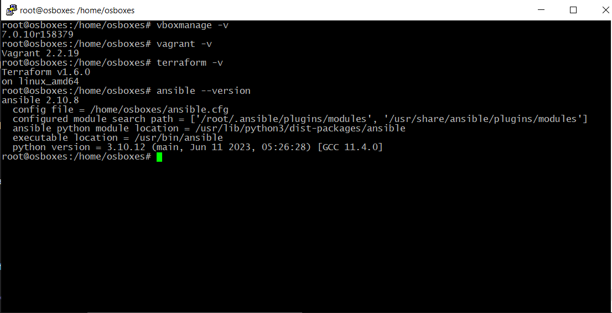
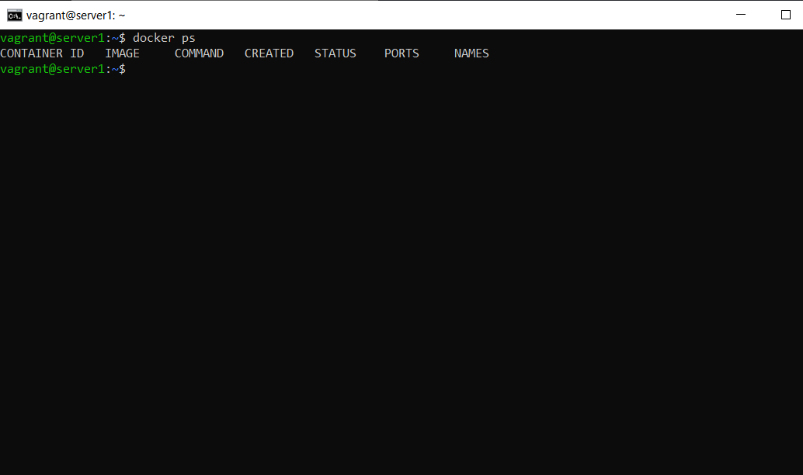

# `Домашнее задание к занятию "5.2. Применение принципов IaaC в работе с виртуальными машинами" - Зозуля Максим`

## Задача 1

- Опишите своими словами основные преимущества применения на практике IaaC паттернов.
- Какой из принципов IaaC является основополагающим?

### Ответ:

- По моему мнению основным преимуществом IaaC является увеличение степени автоматизации развёртывания инфраструктуры, а соответственно увеличение скорости выполнения этой операции и снижение трудозатрат на её выполнение. Из данного преимущества проистекают и все остальные положительные аспекты IaaC такие, как: масштабируемость, стабильность, обеспечение версионности и облегчение документирования (по сути сам конфигурационный файл является документом описывающим инфраструктуру), увеличение безопасности за счёт снижения количества мануальных операций и т.д. 

- Основополагающим принципом IaaC является обеспечение создания/настройки инфраструктуры аналогично процессу разработки программного обеспечения.

## Задача 2

- Чем Ansible выгодно отличается от других систем управление конфигурациями?
- Какой, на ваш взгляд, метод работы систем конфигурации более надёжный push или pull?

### Ответ:

- Главное его отличие от других подобных систем в том, что Ansible использует существующую SSH инфраструктуру, в то время как другие (Saltstack, Chef, Puppet, и пр.) требуют установки агентов на целевые машины

- Pull, т.к. отсутствует единая точка отказа и хранения данных для доступа.

## Задача 3

Установить на личный компьютер:

- VirtualBox
- Vagrant
- Terraform
- Ansible

*Приложить вывод команд установленных версий каждой из программ, оформленный в markdown.*

### Ответ:


```
root@osboxes:/home/osboxes# vboxmanage -v
7.0.10r158379

root@osboxes:/home/osboxes# vagrant -v
Vagrant 2.2.19

root@osboxes:/home/osboxes# terraform -v
Terraform v1.6.0
on linux_amd64

root@osboxes:/home/osboxes# ansible --version
ansible 2.10.8
  config file = /home/osboxes/ansible.cfg
  configured module search path = ['/root/.ansible/plugins/modules', '/usr/share/ansible/plugins/modules']
  ansible python module location = /usr/lib/python3/dist-packages/ansible
  executable location = /usr/bin/ansible
  python version = 3.10.12 (main, Jun 11 2023, 05:26:28) [GCC 11.4.0]
```

## Задача 4 

Воспроизвести практическую часть лекции самостоятельно.

- Создать виртуальную машину.
- Зайти внутрь ВМ, убедиться, что Docker установлен с помощью команды
```
docker ps
```
Vagrantfile из лекции и код ansible находятся в папке.

Примечание. Если Vagrant выдаёт ошибку:
```
URL: ["https://vagrantcloud.com/bento/ubuntu-20.04"]     
Error: The requested URL returned error: 404:
```
выполните следующие действия:

Скачайте с сайта файл-образ "bento/ubuntu-20.04".
Добавьте его в список образов Vagrant: "vagrant box add bento/ubuntu-20.04 <путь к файлу>".
### Ответ:

